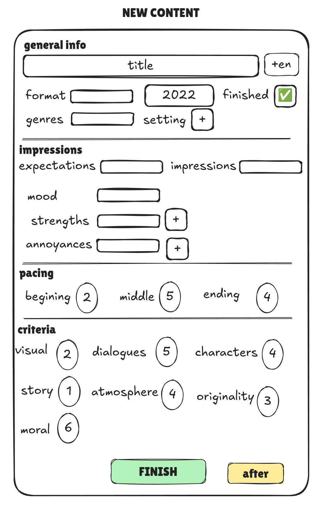
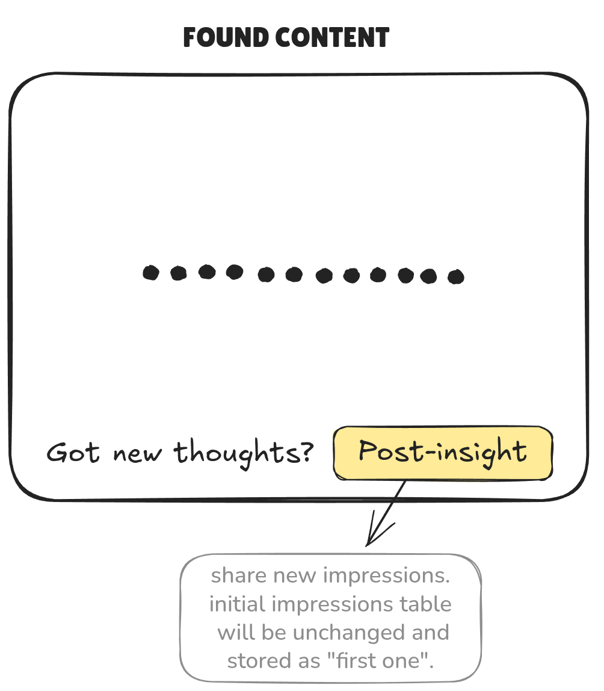
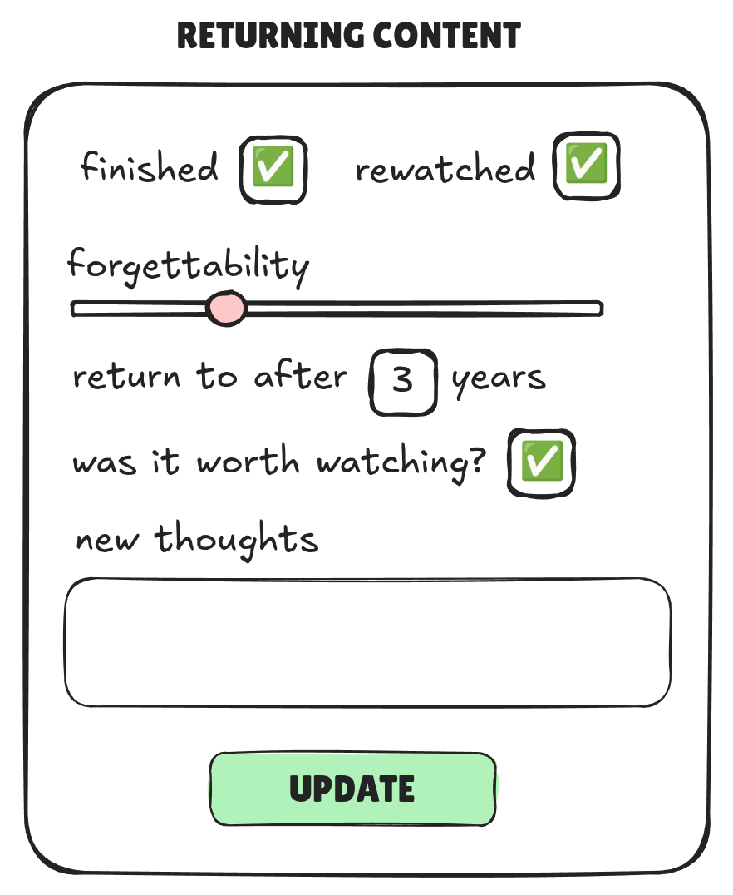

# TV-shows impressions

Forms app to quickly and conviniently record your opinions of TV-shows.

--- 

### main idea

_Save initial cannonical form of opinion of TV-shows on first impressions_

_If you edit them it counts as **post-insight** and will be saved in the new table_

_This way you will see two ways on your perception over time_

---

## add new shows impressions

## search for saved impressions

## extend opinion by adding more details and thoughts

